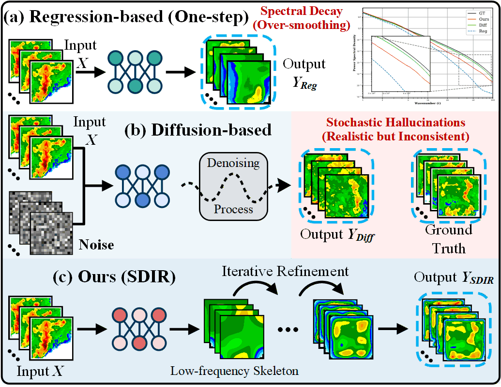
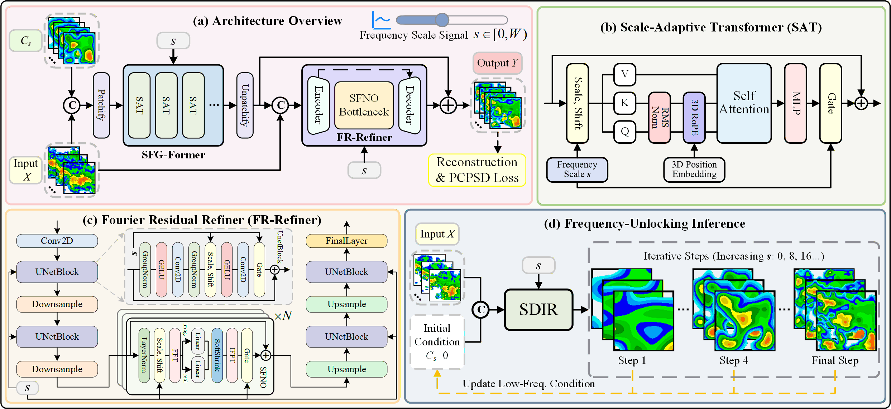

<div align="center">

# 🌧️ SDIR: Spectral-Decoupled Iterative Refinement for Precipitation Nowcasting

[](https://icml.cc/)
[](https://arxiv.org/abs/2606.02661)
[](https://arxiv.org/pdf/2606.02661.pdf)
[](https://opensource.org/licenses/MIT)
[](https://www.python.org/)
[](https://pytorch.org/)

*ICML 2026*

</div>

---

## 📖 Introduction

We propose **SDIR** (**S**pectral-**D**ecoupled **I**terative **R**efinement), a deterministic framework that resolves this dilemma by reformulating nowcasting as a progressive frequency-decoupled refinement process. Starting from a stable low-frequency synoptic skeleton, SDIR iteratively refines high-frequency textures under physical constraints — eliminating both blurring and hallucinations.

<div align="center">
  
  <p><i>Paradigm comparison in precipitation nowcasting. (a) Regression: suffers from spectral decay and loss of peak intensity. (b) Diffusion: generates realistic high-frequency details but produces stochastic hallucinations. (c) SDIR (Ours): reformulates nowcasting as deterministic spectral evolution, progressively restoring high-frequency details from a low-frequency synoptic skeleton.</i></p>
</div>

---

## ✨ Key Features

- **Dual-Path Architecture**: Synergizes the global structural modeling of the **SFG-Former** (Synoptic Frequency-Guided Former with Scale-Adaptive Transformers) and the high-frequency synthesis of the **FR-Refiner** (Fourier Residual Refiner with Scale-Conditioned Fourier Neural Operators).
- **Spectral Training Curriculum**: Samples frequency scale signals from a Beta distribution, biasing training toward stable synoptic structures before tackling complex convective textures.
- **PCPSD Loss**: A Physically Consistent Power Spectral Density loss with dynamic frequency masking enforces adherence to atmospheric turbulence power laws (Kolmogorov energy cascade).
- **Frequency-Unlocking Inference**: A coarse-to-fine multi-step inference schedule that progressively expands frequency bandwidth, suppressing hallucinations and preserving high-intensity convective cells.

### Architecture

<div align="center">
  
  <p><i>Overall architecture of SDIR. (a) Architecture Overview: the SFG-Former extracts the synoptic skeleton and the FR-Refiner synthesizes high-frequency residuals. (b) Scale-Adaptive Transformer. (c) Fourier Residual Refiner. (d) Frequency-Unlocking Inference: starting from a zero state (s=0), SDIR iteratively increases s to progressively synthesize high-resolution details.</i></p>
</div>

---

## 🔧 Installation

```bash
git clone https://github.com/RuntimeWarning/SDIR.git
cd SDIR
pip install -r requirements.txt
```

---

## 📦 Pre-trained Models

Pre-trained SDIR model weights are available on [Google Drive](https://drive.google.com/drive/folders/10jiWIXpfn6j-7UvD7-xcbu3ezrxgKoCc?usp=drive_link).

Please download the required checkpoint from the Google Drive folder and place it in the `checkpoints/` directory:

```bash
mkdir -p checkpoints
```

After downloading, your project structure should look like:

```text
SDIR/
├── checkpoints/
│   └── sevir.pth
├── imgs/
├── main.py
└── requirements.txt
```

---

## 🚀 Training

### Single GPU

```bash
python main.py --is_train True --datasets shanghai --img_size 256 --patch_size 8 --output_length 20
```

### Multi-GPU Training with 🤗 Accelerate

SDIR supports **multi-GPU distributed training** via [Hugging Face Accelerate](https://huggingface.co/docs/accelerate).

**Step 1: Configure Accelerate**

```bash
accelerate config
```

Follow the prompts to set up your distributed training environment, including the number of GPUs and mixed-precision configuration.

**Step 2: Launch distributed training**

```bash
accelerate launch main.py --is_train True --datasets shanghai --img_size 256 --patch_size 8 --output_length 20
```

> **Tip:** We trained SDIR on 4× NVIDIA RTX 4090D GPUs using AdamW with an initial learning rate of 3e-4.

---

## 🔍 Inference

### Single GPU

Download the pre-trained checkpoint from [Google Drive](https://drive.google.com/drive/folders/10jiWIXpfn6j-7UvD7-xcbu3ezrxgKoCc?usp=drive_link) and place it at `checkpoints/sdir_shanghai.pth`.

```bash
python main.py --is_train False --datasets shanghai --img_size 256 --patch_size 8 --output_length 20 --pretrained_model checkpoints/sdir_shanghai.pth
```

### Multi-GPU Inference with 🤗 Accelerate

SDIR also supports **distributed multi-GPU inference**, enabling fast evaluation on large test sets.

```bash
accelerate launch main.py --is_train False --datasets shanghai --img_size 256 --patch_size 8 --output_length 20 --pretrained_model checkpoints/sdir_shanghai.pth
```

---

## 📋 Citation

If you find this work useful, please consider citing our paper:

```bibtex
@inproceedings{zhou2026sdir,
  title     = {Learning to Refine: Spectral-Decoupled Iterative Refinement Framework for Precipitation Nowcasting},
  author    = {Zhou, Yunlong and Zhao, Chen and Peng, Danyang and Ji, Fanfan and Yuan, Xiao-Tong},
  booktitle = {International Conference on Machine Learning (ICML)},
  year      = {2026}
}
```

---

## 📄 License

This project is released under the MIT License.